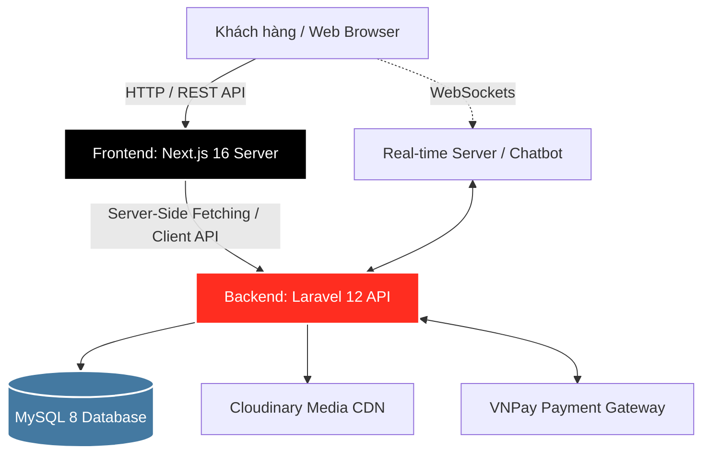

<div align="center">
  <a href="#">
    
  </a>

  <h1>🏸 RACKET PRO <i>Store</i> 🎾</h1>
  
  <p>
    <b>Hệ thống Thương mại Điện tử Đỉnh cao chuyên biệt cho Vợt & Phụ kiện Thể thao</b><br>
    <i>Được xây dựng với sức mạnh của Next.js 16 (React 19) & Laravel 12 API</i>
  </p>

  <p>
    <a href="#tech-stack"></a>
    <a href="#frontend"></a>
    <a href="#backend"></a>
    <a href="#database"></a>
    <a href="#realtime"></a>
  </p>
  
  <p>
    <a href="#-giới-thiệu">Giới thiệu</a> •
    <a href="#-tính-năng-cốt-lõi">Tính năng</a> •
    <a href="#-kiến-trúc-hệ-thống">Kiến trúc</a> •
    <a href="#-công-nghệ-sử-dụng">Công nghệ</a> •
    <a href="#-hướng-dẫn-chạy-local">Cài đặt</a>
  </p>
</div>

---

## 🌟 Giới thiệu

**Racket Pro Store** không chỉ là một website bán hàng thông thường, mà là một **Nền tảng E-Commerce chuyên sâu** được đo ni đóng giày cho dân chơi hệ thể thao (Cầu lông, Tennis, Pickleball...). 

Áp dụng mô hình **Headless E-Commerce** tách biệt hoàn toàn giữa Frontend (Next.js SSR/SSG) và Backend (Laravel RESTful API), hệ thống mang lại trải nghiệm UX/UI mượt mà như một Native App (SPA), tốc độ tải trang tính bằng mili-giây, khả năng scale linh hoạt và tối ưu hóa SEO tuyệt đối.

---

## 🔥 Tính năng Cốt lõi

### 🛍️ Client-Side (Storefront - Dành cho Vợt thủ)
| Tính năng | Mô tả chi tiết | Công nghệ & Tiện ích |
| :--- | :--- | :--- |
| **🔐 Bảo mật chuẩn Enterprise** | Xác thực JWT Token bảo mật cao, mã hóa mật khẩu, Verify Email OTP. | `Tymon/JWT-Auth` |
| **🏸 Xử lý Biến thể Vợt Phức tạp** | Hỗ trợ sản phẩm nhiều chiều không giới hạn: **Trọng lượng (3U/4U), Độ to cán (G4/G5), Sức căng (Tension)**. | Lọc đa điều kiện, Real-time stock |
| **🛒 Flow Mua Hàng Siêu Tốc** | Thêm vào giỏ hàng với Animation mượt mà, quản lý nhiều địa chỉ nhận hàng (Address Book). | `Framer Motion`, State Management |
| **💳 Thanh Toán Tích hợp** | Chạm là thanh toán qua cổng **VNPAY** - An toàn, nhanh gọn, tự động webhook trạng thái đơn. | `VNPAY Gateway` |
| **💬 Real-time Trợ lý ảo** | Chatbot tư vấn chọn vợt theo lối chơi (Công, Thủ, Phản tạt) phản hồi theo thời gian thực. | `Socket.io-client` |
| **⭐ Đánh giá & Cộng đồng** | Khách mua hàng có thể rate 5 sao, tải lên ảnh feedback thực tế, thả tim (Like) và Reply chéo nhau. | Upload ảnh `Cloudinary` |
| **🎁 Hệ thống Khuyến mãi** | Ví Voucher thông minh: Thu thập mã giảm giá (Claim Voucher), tính toán tự động giá trị giảm ở Checkout. | Logic nghiệp vụ phức tạp |

### 👑 Admin-Side (Dashboard - Dành cho Chủ Shop)
* **Thống kê Real-time:** Biểu đồ doanh thu cực kỳ trực quan với `Chart.js`, phân tích top vợt bán chạy, tỷ lệ chuyển đổi.
* **Quản trị Kho Hàng (Inventory):** Quản lý nghiêm ngặt qua hệ thống Phiếu Nhập Hàng (Imports). Theo dõi chính xác từng SKU biến thể (Ví dụ: còn 5 cây Yonex 88D Pro bản 3U).
* **Quản lý Vận hành:** CRUD toàn bộ hệ sinh thái: Sản phẩm, Danh mục, Nhãn hiệu, Bài viết/Blog kiến thức cầu lông.
* **Tùy biến Giao diện:** Upload Banners sự kiện, cấu hình Menu động và các thiết lập toàn cục của website ngay trên CMS.

---

## 🏗️ Kiến trúc Hệ thống



*(Lưu ý: Github hỗ trợ render trực tiếp sơ đồ Mermaid ở trên)*

---

## 💻 Công nghệ Sử dụng

### 🎨 Frontend Ecosystem (`/nvdn-frontend`)
<table style="width: 100%">
  <tr>
    <td align="center"><b>Framework</b></td>
    <td align="center"><b>UI / Styling</b></td>
    <td align="center"><b>State & Utils</b></td>
  </tr>
  <tr>
    <td>
      - ⚛️ <b>React 19.2</b><br>
      - 🚀 <b>Next.js 16.0</b> (App Router, SSR)<br>
      - 📘 <b>TypeScript / JS</b>
    </td>
    <td>
      - 🎨 <b>Tailwind CSS 4</b><br>
      - 🐜 <b>Ant Design 6</b><br>
      - ✨ <b>Framer Motion</b> (Animations)<br>
      - 📊 <b>Chart.js</b> (Biểu đồ)
    </td>
    <td>
      - 📡 <b>Axios</b> (API Calls)<br>
      - ⚡ <b>Socket.io-client</b> (Realtime)<br>
      - 🍪 <b>JS-Cookie</b> (Auth Tokens)<br>
      - 🔔 <b>React Toastify</b> (Alerts)
    </td>
  </tr>
</table>

### ⚙️ Backend Ecosystem (`/nvdn-backend`)
<table style="width: 100%">
  <tr>
    <td align="center"><b>Core</b></td>
    <td align="center"><b>Database & Storage</b></td>
    <td align="center"><b>Packages</b></td>
  </tr>
  <tr>
    <td>
      - 🐘 <b>PHP 8.2+</b><br>
      - 🔴 <b>Laravel 12.0</b><br>
      - 🔒 <b>Sanctum & JWT Auth</b>
    </td>
    <td>
      - 🗄️ <b>MySQL 8</b><br>
      - ☁️ <b>Cloudinary</b> (Image CDN)<br>
      - 💾 <b>Local Storage</b> (Logs, Cache)
    </td>
    <td>
      - 🛡️ <b>tymon/jwt-auth</b><br>
      - ☁️ <b>cloudinary-laravel</b><br>
      - 🧪 <b>Pest / PHPUnit</b> (Testing)
    </td>
  </tr>
</table>

---

## 🚀 Hướng dẫn chạy Local (Quick Start)

### Bố cục thư mục
```bash
.
├── nvdn-backend/      # Laravel API
└── nvdn-frontend/     # Next.js App
```

### 1. Khởi chạy Backend (API)
```bash
# Di chuyển vào thư mục backend
cd nvdn-backend

# Cài đặt các gói thư viện PHP
composer install

# Tạo file biến môi trường & gen key
cp .env.example .env
php artisan key:generate

# Chạy migration & seed dữ liệu mẫu (Database)
php artisan migrate --seed

# Khởi chạy server
php artisan serve
```
> 💡 **Tip:** Hãy chắc chắn bạn đã cấu hình thông tin kết nối `DB_DATABASE`, `CLOUDINARY_URL` và config `VNPAY` bên trong file `.env`.

### 2. Khởi chạy Frontend (Storefront)
```bash
# Di chuyển vào thư mục frontend
cd nvdn-frontend

# Cài đặt các gói npm
npm install

# Khởi chạy dev server với Turbopack
npm run dev
```
> 🌐 Mở trình duyệt tại: [http://localhost:3000](http://localhost:3000)

---

## 📸 Thư viện Hình ảnh
*(Bạn hãy cập nhật những hình ảnh đẹp nhất của dự án vào đây nhé)*

<details open>
<summary><b>1. Giao diện Cửa hàng (Storefront)</b></summary>
<br>
<p align="center">
  
</p>
</details>

<details>
<summary><b>2. Bộ lọc Sản phẩm & Biến thể (Trọng lượng, Cán vợt)</b></summary>
<br>
<p align="center">
  
</p>
</details>

<details>
<summary><b>3. Giỏ hàng & Cổng thanh toán VNPay</b></summary>
<br>
<p align="center">
  
</p>
</details>

<details>
<summary><b>4. Trang quản trị CMS (Admin Dashboard)</b></summary>
<br>
<p align="center">
  
</p>
</details>

<br>
<div align="center">
  <i>Được xây dựng với 💖 và nỗ lực tuyệt vời!</i><br>
  <b>Nếu bạn thấy dự án này chất lượng, hãy tặng repo này 1 ⭐ nhé!</b>
</div>
